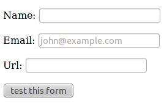
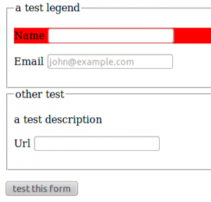

Django forms, HTML5 et fieldsets
################################
:date: 2011-02-11 22:56
:category: django

J'adore l'open-source, et j'adore le libre.

Aujourd'hui, à 20h30, je me dis que j'aimerais bien pouvoir utiliser
les nouveaux *form input* de HTML5 dans mes formulaires `django`_. Je me
rappelle alors de l'excellent `django-floppyforms`_ de ce cher `Bruno Renié`_.

django-floppy-forms : la librairie de widgets
~~~~~~~~~~~~~~~~~~~~~~~~~~~~~~~~~~~~~~~~~~~~~

Quelques minutes et un *pip install django-floppyforms* plus tard, je
me retrouve avec un petit formulaire de test :

::

    #!/usr/bin/env python
    # -*- coding: utf-8 -*-

    import floppyforms as forms

    class TestForm(forms.Form):
        name = forms.CharField()
        email = forms.EmailField(widget=forms.EmailInput(attrs={'placeholder': 'john@example.com'}))
        url = forms.URLField()

Ce qui me donne le résultat visuel suivant :

On y voit bien le *placeholder* dans le champ de type *email*. Sur
l'image suivante, on voit la validation faite directement au niveau du
browser (firefox 4b11) :

.. image:: images/html5_form_validation.png
    :alt: Formulaire Django avec validation
    :align: center

A 20h45 : "ce que j'aimerais vraiment bien, c'est pouvoir scinder mon
formulaire en *fieldsets*, comme le permet l'administration de django".
Va-t-il falloir que je me mette à développer? Que nenni, cher lecteur,
comme tu l'aura deviné, un autre développeur de talent, un certain `Carl Meyer`_ nous propose le très pratique `django-form-utils`_.

django-form-utils : une méthode propre pour spécifier des fieldsets
~~~~~~~~~~~~~~~~~~~~~~~~~~~~~~~~~~~~~~~~~~~~~~~~~~~~~~~~~~~~~~~~~~~

Encore quelques minutes et un *pip install django-form-utils* plus
tard, voici le code du formulaire :

::

    #!/usr/bin/env python
    # -*- coding: utf-8 -*-

    import floppyforms as forms
    from form_utils.forms import BetterForm

    class TestForm(BetterForm):
        name = forms.CharField()
        email = forms.EmailField(widget=forms.EmailInput(
                    attrs={'placeholder': 'john@example.com'}))
        url = forms.URLField()

        class Meta:
            fieldsets = [
                ('test', {
                    'fields': ['name', 'email'],
                    'legend': 'a test legend',
                }),
                ('other test', {
                    'fields': ['url'],
                    'description': 'a test description',
                    'classes': ['advanced', 'collapse']
                }),
            ]
            row_attrs = {'name': {'style': 'background: #f00'}}

Et le template, un poil plus complexe que le *{{ form.as\_p }}*
précédent :

::

    {{ form.non_field_errors }}
    
    <fieldset class="{{ fieldset.classes }}">
        <legend>{{ fieldset.legend }}</legend>
        
            
{{ fieldset.description }}

        
        
            
                {{ field }}
            
                <p{{ field.row_attrs }}>
                    {{ field.errors }}
                    {{ field.label_tag }}
                    {{ field }}
                

            
        
    </fieldset>
    

Et voici le résultat (les moqueurs reconnaîtrons mon talent pour tout
ce qui touche au design) :

21h00 : Tout ça est vraiment super. Mais... quitte a être
exigeant, est-ce que je pourrai avoir des fieldsets ET un template plus
simple? Par exemple un layout générique du style `uni-form`_... c'est là
que `Daniel Greenfeld`_ entre en jeu avec son projet pour djangonautes
fainéants `django-uni-form`_.

django-uni-form: les uni-forms pour django
~~~~~~~~~~~~~~~~~~~~~~~~~~~~~~~~~~~~~~~~~~

Vous connaissez le refrain, quelques minutes et un *pip install
django-uni-form* plus tard :

::

    #!/usr/bin/env python
    # -*- coding: utf-8 -*-

    import floppyforms as forms
    from django.forms import Form
    from uni_form.helpers import FormHelper, Submit
    from uni_form.helpers import Layout, Fieldset

    class TestForm(Form):
        name = forms.CharField()
        email = forms.EmailField(widget=forms.EmailInput(
                    attrs={'placeholder': 'john@example.com'}))
        url = forms.URLField()
        helper = FormHelper()
        layout = Layout(Fieldset('a test legend', 'name', 'email'),
                        Fieldset('other test', 'url'))
        helper.add_layout(layout)
        submit = Submit('submit','test this form')
        helper.add_input(submit)

Et le template, beaucoup plus simple du coup :

::

    
    
        
    

Conclusion
~~~~~~~~~~~

Il fait bon être fainéant, utiliser django, et les outils déjà
disponibles en open-source. Les applications que j'ai présentées ici ont
été bien pensées, et sont *pluggable* : on peut facilement les rajouter
à son projet et les utiliser ou même les combiner!

Dans notre cas on a pu tester l'utilisation de widgets html5
(django-floppy-forms) avec un layout par fieldset défini dans la class
*Meta* du formulaire (django-form-utils), ou grâce à un *helper*
(django-uni-form).

Pour le moment mon cœur balance entre les deux, la solution utilisant
la sous-class *Meta* me paraissant plus naturelle, mais l'utilisation
d'un layout robuste et soigné comme les uni-form étant plus simple,
"standard" et économisant plus de temps.

A quand un projet permettant d'hériter d'une classe UniForm, dans
laquelle on définit les fieldsets dans une sous-classe *Meta* ?

Ah, au fait, de 21h00 à 23h00, écriture de ce billet... une demi heure
pour tester trois projets, et presque deux heures pour en parler,
personne n'aurait une *pluggable app* qui pond des billets ?

.. _django: http://www.djangoproject.com/
.. _django-floppyforms: https://github.com/brutasse/django-floppyforms
.. _Bruno Renié: http://bruno.im/
.. _Carl Meyer: http://twitter.com/#!/carljm
.. _django-form-utils: https://bitbucket.org/carljm/django-form-utils/src
.. _uni-form: http://sprawsm.com/uni-form/
.. _Daniel Greenfeld: http://pydanny.blogspot.com
.. _django-uni-form: https://github.com/pydanny/django-uni-form
