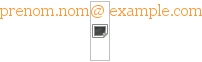

Obfuscation de l'email alternative et accessible
#####################################################
:date: 2009-09-27 12:51
:category: misc
:tags: web

`English translation`_ of this post also available.

Le Problème
~~~~~~~~~~~

Les quatre prérequis pour l'obfuscation d'une adresse mail sont les
suivants:

#. Ne pas pénaliser l'utilisateur: pouvoir cliquer sur le mail
#. Ne pas pénaliser l'utilisateur: pouvoir copier/coller l'adresse
#. Ne pas pénaliser l'utilisateur: l'addresse doit rester accessible (en
   mode texte, sans css et/ou sans js)
#. Difficilement récupérables par des spambots

L'ordre n'est pas une coïncidence: le but de l'obfuscation est bien
entendu d'empêcher les spambots de récuperer l'adresse email, **mais
celà ne doit en aucun cas pénaliser l'utilisateur du site**.

Les différentes méthodes d'obfuscation d'adresse email qui tournent sur
la toile, malheureusement, échouent en général au moins sur l'un des 4
points listés.

La Solution
~~~~~~~~~~~

Pour les utilisateurs de webkit avec le javascript désactivé, voir les
`limitations`_.

::

    <a href="/contactform.html" id="emailaddress">
        prenom.nomexample.com
    </a>

    

Et voici le résultat: 

.. raw:: html

    
<a id="emailaddress" href="/contactform.html">prenom.nomexample.com</a> 
    
    

L’Explication
~~~~~~~~~~~~~

Si javascript est activé, l’attribut href ainsi que le contenu du lien
sont modifiés afin que l’obfuscation soit invisible. Rien de nouveau donc.

Si javascript est désactivé, en utilisant le contenu alternatif d’une
image inexistante pour remplacer le « @ », on obtient plusieurs résultats intéressants:

- les lecteurs d’écrans liront l’attribut alt pour l’image, l’email étant donc très facilement déchiffrable
- l’attribut alt est affiché, rendant l’obfuscation invisible, même en mode texte ou sans css
- l’adresse est copiable sans aucun soucis
- l’email est toujours clickable, le lien menant sur un formulaire de contact

Un gros avantage d’utiliser un attribut d’un tag html est qu’il contre les spambots qui ne récupèrement que le texte, et non les tags html, afin de ne pas être bloqués par les méthodes d’obfuscation basées sur l’insertion de tags invisibles ou de commentaires dans l’adresse.
Ici, supprimer le tag  revient à perdre l’information capitale du « @ ».

Les limitations
~~~~~~~~~~~~~~~

Il y a deux bugs non résolus dans Webkit à la date de rédaction de cet article:

- `Bug 5566 – ALT attribute value not displayed when image is missing`_
- `Bug 11200 – Image alt text not included in plain-text version when copying`_

Les conséquences sont alors visible sur un navigateur utilisant Webkit, et avec le javascript désactivé:

    Image manquante sous Webkit

De plus, l’adresse n’est plus copiable, mais le lien (vers le formulaire de contact) reste disponible.

Une solution serait alors d’utiliser une image contenant le symbole « @ », mais celà peut poser des problèmes de style (couleur, famille et taille de la police, anti-aliasing…):

    Adresse email avec une image remplaçant le @

Note
----

Il est possible d’afficher l’attribut ``alt`` de l’image sous webkit, en forçant la taille de l’image pour qu’elle soit assez grande::

    

    Image assez grande pour afficher l'attribut alt

C’est hideux, mais ça reste lisible, et ça n’impacte que les quelques pourcents d’utilisateurs de webkit qui ont le javascript désactivé.

Conclusion
~~~~~~~~~~

Voilà donc une nouvelle méthode d’obfuscation d’adresse email, qui devrait être efficace (au moins autant que les autres) contre les spambots, mais qui impacte le moins possible l’utilisateur final.
Et surtout, l’adresse est accessible pour les lecteurs d’écrans!

.. _English translation: http://acamo.fr/blog
.. _limitations: #limitations
.. _Bug 5566 – ALT attribute value not displayed when image is missing: https://bugs.webkit.org/show_bug.cgi?id=5566
.. _Bug 11200 – Image alt text not included in plain-text version when copying: https://bugs.webkit.org/show_bug.cgi?id=11200
