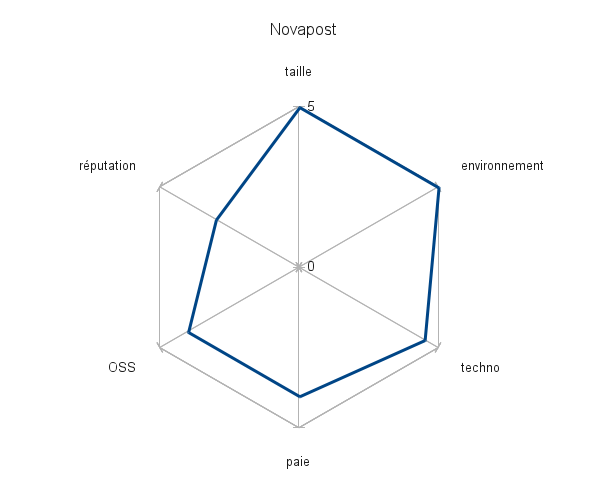

Taxonomie des entreprises
#########################
:date: 2012-10-03 17:40
:category: misc

Nous avons vu dans un `précédent billet`_ qu'il existait deux principales
échelles qu'il était possible de gravir dans la carrière d'un développeur.

Ces deux échelles permettent d'accéder à des types d'entreprise très
différents.

Nous allons nous essayer à une taxonomie des entreprises, à une classification
selon une liste de critères.

Attention, ce billet est mon point de vue personnel. Ne le prenez donc pas au
pied de la lettre, mais plutôt comme un guide pour évaluer une entreprise, pour
choisir parmi différents types d'entreprises, celui qui correspondra le plus à
l'échelle qu'on a choisi de gravir.

Je vais essayer de rester le plus objectif possible dans l'énoncé des critères,
sans laisser transparaître de jugement. En effet, il vous appartient de définir
pour chacun des critères, ce qui correspond le plus à vos attentes, à vos
souhaits.

Ce billet est long, très très long.

Les critères
============

Je vois plusieurs critères qui peuvent jouer sur le choix d'une entreprise
lorsqu'un développeur est en recherche d'un emploi, de nouveaux horizons, voire
même de créer sa boite :

* la taille et répartition géographique : nombre d'employés, entreprise locale,
  nationale, internationale
* la visibilité/réputation : quelle image est-ce qu'elle véhicule, quel domaine
* le rapport à l'open source : pour, contre, ne se prononce pas, pratique ou
  non
* les perspectives d'évolution : nulles, à l'ancienneté, changement de métier,
  d'expertise, nécessaire pour évoluer
* la paie
* technologie : à la pointe ou pas, imposée ou non
* l'environnement de travail

Taille et répartition géographique
==================================

Plus une entreprise est grande (en nombre d'employés), et avec une répartition
géographique large, plus il y a de risques de se retrouver comme un numéro, un
employé de plus.

La contrepartie, est de bénéficier de meilleurs avantages : comité d'entreprise
plein aux as, plus de marge pour évoluer, changer de service, « monter en
grade » (diriger une équipe, nous y reviendrons). Et si il y a des plans
sociaux, les indemnités sont en général bien plus importantes, et accompagnées
de propositions de requalification, de formation. Il y a aussi un sentiment de
sécurité, en se disant que l'entreprise est « too big to fail ».

Au contraire, dans une entreprise de petite taille, il est plus facile de
compter, de faire une différence, de se sentir un maillon indispensable de la
vie de l'entreprise. Il est aussi plus facile de communiquer sur ce qu'on fait
au quotidien, seul ou en équipe, sur sa valeur ajoutée.

Il est par contre plus difficile de négocier une augmentation, un changement de
statut, un aménagement du temps de travail, ou toute autre chose qui pourrait
entraver la progression de l'entreprise. Mais en général la négociation se fait
directement avec l'employeur, et non au travers d'une équipe de ressources
humaines.

Visibilité et réputation
========================

Est-ce qu'on préfère une entreprise dynamique ? Stable ? Historique ou jeune et
innovante ?

Est-ce qu'on privilégie une entreprise dotée d'une aura de bienfaisance, comme
une entreprise qui travaille pour des ONG, pour de l'humanitaire, ou plutôt une
entreprise qui représente le pouvoir, financier par exemple, comme une place
des marché, une banque, un assureur...

Rapport à l'open-source
=======================

Si on cherche à gravir l'échelle de la visibilité, il est important de
privilégier une entreprise qui le permette, voire qui l'encourage.

Dans ce domaine, les entreprises peuvent être très différentes :

* prédateur : utilise au quotidien des logiciels, serveurs, librairies...
  open-source, mais ne contribue pas, et interdit à ses employés de contribuer
  sur le temps de travail, ou sur du code développé par/pour l'entreprise.
* neutre : utilise, mais contribue aussi à l'occasion. À l'occasion de la
  découverte d'un bug dans une application, ou de la création d'une nouvelle
  librairie, le développeur est autorisé, voire encouragé, à contribuer, y
  compris sur son temps de travail pour l'entreprise.
* moteur : le cœur de métier de l'entreprise est basé sur un logiciel qui est
  en open-source, par exemple Hybird_ avec son CRM Crème. Ou encore Mozilla_
  qui a pour crédo « we develop in the open ».

Surtout, se méfier comme de la peste des entreprises qui demandent une forte
visibilité lors du recrutement (réclament le compte
github/bitbucket/stackoverflow), mais ne contribuent pas, ni ne permettent à
leurs employés de contribuer. Ces entreprises profitent de l'open-source, sans
qu'il y puisse y avoir de retour. De plus, lorsqu'un développeur voudra la
quitter, et trouver un autre employeur, il ne pourra plus présenter de projet
récent sur lequel il aura pu travailler.

Oui, il est possible de contribuer et de créer sur son temps libre, mais
combien d'heures arrivez-vous à libérer pour ça par semaine, en respectant un
bon équilibre travail-vie, en accordant du temps à votre famille et à vous
même ?

Perspectives d'évolution
========================

De la même manière, on voit clairement  l'intérêt d'avoir des perspectives
d'évolution quand on veut gravir l'échelle de l'entreprise.

Il est en effet important de pouvoir changer de poste, monter en grade, diriger
une équipe, prendre des responsabilités, dans l'optique de pouvoir se
« vendre » lors d'un entretien d'embauche ultérieur.

Tout comme il faut se méfier des entreprises prédatrices de visibilité, il faut
se méfier des entreprises qui vont vous demander de justifier de
responsabilités ou de management dans votre précédent emploi, pour ensuite vous
cantonner dans un poste sans possibilité d'évoluer.

J'ai vécu (très brièvement) cette expérience dans une boite qui promettait
monts et merveilles, mais une fois embauché, j'ai vite ressenti le « plafond de
verre », celui qui délimite les sous-fifres du dessous, des chefs et patrons du
dessus.

Paie
====

Aspect non négligeable, quoi qu'on en dise, et ce pour au moins deux raisons :

* le salaire, c'est en grande partie la valorisation du travail qui est fait
* un salaire suffisant permet de se concentrer sur son travail, sans avoir à
  penser à faire un deuxième travail, s'établir en auto-entrepreneur...

Attention sur ce point glissant. Obtenir un meilleur salaire, c'est aussi subir
une plus grosse pression sociale. Si on est mieux payé que X, alors il faut
apporter plus de valeur que X. Il n'est pas confortable d'être la personne la
mieux payée.

Par ailleurs, un fort salaire peut entraîner un niveau de vie élevé, qui sera
comme une prison dorée : il est très facile d'augmenter son niveau de vie, mais
le réduire c'est `une autre paire de manches`_. Et trouver une entreprise qui
corresponde à ses critères, ET qui propose un salaire au moins aussi élevé,
c'est beaucoup plus ardu.

Technologie
===========

La encore, deux écoles.

Je ne le cache pas, je suis fan de Python, de Clojure, et d'autres technos
funs et à la pointe. Par contre, je sais que ce n'est pas dans ce domaine que
je trouverai le plus de propositions de travail.

Java, PHP sont eux très largement répandus, très utilisés, et donc entraînent
automatiquement une très forte demande.

Mais sans même parler de langages, certaines entreprises travaillent et
imposent certaines technologies, certains *frameworks*, librairies, outils,
éditeurs.

Quelle est la place laissée aux expérimentations sur d'autres technologies ?

Est-ce que le but est de devenir un expert très pointu sur une technologie
précise, ou plutôt un couteau suisse, un touche à tout, un polyvalent ?

Environnement de travail
========================

Le plus gros morceau pour la fin. Ce critère regroupe plusieurs sous critères,
qui peuvent bien entendu être séparés en critères à part entière selon leur
importance aux yeux du chercheur d'emploi.

Travail seul ou en équipe
~~~~~~~~~~~~~~~~~~~~~~~~~

Quelle est votre préférence ? Un dicton malien dit « seul on va plus vite,
ensemble on va plus loin. »

C'est vraiment une question de goût. Seul, on est plus libre de son travail,
mais on est aussi plus sous pression, sans aide, sans recours ni soutient. À
plusieurs, on est plus confortable, on peut s'entraider, un sentiment
d'émulation peut se mettre en place, une saine compétition.
Il y a les revues de code, les discussions au coin de la machine à café, ou
autour d'une bière, les coups de main dans les moments de stress ou de
détresse, les conseils avisés, la possibilité de faire du `pair-programming`_.

Mais il faut travailler en équipe, et c'est parfois compliqué. Il faut arriver
à suivre le travail de chacun, se tenir au courant des modifications, des
ajouts de fonctionnalité, il faut négocier, convaincre, écouter, accepter,
partager.

Matériel
~~~~~~~~

Ce point est important. Il suffit, pour s'en convaincre, d'écouter l'histoire
d'un développeur anonyme : « On m'avait promis un ordinateur portable et un
bureau à ma taille. Le premier jour, lors de mon arrivée dans le bureau, j'ai
vu mes collègues ramener une table branlante, un pied ne tenant plus que par
une vis, et le responsable sortir de la salle serveur avec un écran cathodique
14", un vieux clavier, une souris à boule, et un vieux pentium poussif (un des
serveurs). Trois mois après, à la veille de la fin de ma première période
d'essai, rien n'avait changé, j'ai démissionné. »

Si vous avez besoin d'une justification comptable pour investir sur du bon
matériel de développement, vous pouvez jeter un œil à l'article `équipez vos
développeurs`_.

Et sachez, patrons, chefs d'équipe, ressources humaines, ou qui que ce soit qui
gère le matériel dans votre entreprise, que ça peut être très humiliant de
devoir quémander pour avoir un outil de travail correct. Un chauffeur de taxi
ne voudrait pas passer sa journée dans une vieille guimbarde, de la même
manière, un développeur ne supportera pas du matériel obsolète, lent, une
chaise mal adaptée (pour ceux qui travaillent encore assis ;), un écran de
mauvaise qualité...

Perception de la valeur d'un développeur
~~~~~~~~~~~~~~~~~~~~~~~~~~~~~~~~~~~~~~~~

Quelle est la perception de la valeur d'un développeur dans l'entreprise ?
Est-ce qu'il est perçu comme un technicien, un exécutant ? Est-ce que le patron
éclate de rire quand on lui explique que le développement, ça s'apparente à un
métier créatif ?

Là encore, croyez-en l'expérience d'un développeur pas si anonyme qui a testé
pour vous, le patron rigoleur de la vieille école, mais aussi la grosse boite
qui classe par ordre d'importance dans la boite :

#. le patron (logique)
#. les électroniciens
#. les opticiens
#. le bureau d'étude
#. l'administration
#. les secrétaires
#. les développeurs

On obtient alors des choses intéressantes, comme par exemple des ordinateurs
trop vieux et obsolètes pour les secrétaires, qui sont offerts au développeurs.
Ou encore une négociation de salaire fort surprenante.

Détrompez-vous, ce ne sont pas des cas isolés, et on retrouve malheureusement
souvent, surtout en France, surtout dans les boites dirigées par des patrons de
la vieille école (comprendre, ceux qui se sont fait avant l'apparition de
l'informatique utilisée couramment dans les entreprises), ce genre de
réactions.

Et encore plus souvent, le discours suivant : « Des développeurs, on en trouve
à la pelle à notre époque. Demain, je peux trouver n'importe quel nouveau
diplômé tout frai émoulu, payé une fraction de ton salaire, et qui fera au
moins aussi bien que toi. »

Ou encore : « À ton âge, c'est dommage que tu sois encore développeur. Il est
temps pour toi d'évoluer, de devenir chef, de diriger une équipe, ou au moins
de devenir chef de projet, ou consultant technique. Tu as du potentiel, c'est
dommage de le gâcher en restant prostré derrière ton écran toute la journée.
C'est bon pour les juniors ça. »

Non, un développeur n'a pas forcément pour vocation de diriger une équipe.
C'est un autre métier. De même pour chef de projet, c'est un autre métier. Je
ne parle même pas de « technical consultant » ou autre « technico-commercial ».

Un développeur peut tout à fait souhaiter devenir un bon développeur, puis un
excellent développeur, et de se perfectionner jour après jour. On trouve
facilement (à l'étranger, aux USA en particulier) des développeurs bien mieux
payés que leurs chef d'équipe ou chef de projet. Et ça paraît logique, vu que
ce sont des métiers différents.

On imagine pas proposer à un mécanicien d'évoluer pour devenir charcutier, ou à
un dentiste d'évoluer pour devenir boulanger. Ce sont des métiers différents.
Qui demandent des qualités différentes.

Petite astuce : en général, une entreprise qui a un blog technique (comme
`celui de Novapost`_ par exemple), qui sponsorise des évènements et conférences
pour développeurs, qui encourage ses employés à participer à des *sprints* (en
leur offrant les jours de congé)... c'est une entreprise qui accorde une grande
valeur à ses développeurs. C'est bon signe !

Prodonfeur/hauteur de la hiérarchie
~~~~~~~~~~~~~~~~~~~~~~~~~~~~~~~~~~~

Plus une entreprise est grande, plus il y a de chances que la hiérarchie soit
très profonde. Qu'on se retrouve avec des chefs, des patrons, des responsables,
des supérieurs, des boss, des n+1, n+2 et *tutti quanti*.

D'un côté c'est une opportunité pour quelqu'un qui souhaite prendre des
responsabilités : il y a de la place pour se faire son trou, monter dans la
hiérarchie petit à petit. D'un autre côté, quand on veut apporter un
changement, il faut convaincre non un ou deux supérieurs, mais parfois beaucoup
beaucoup plus.

Il y a aussi des entreprises qui ont une hiérarchie très profonde/haute (tout
dépends du point de vue), et on se retrouve avec plus de responsables et
décideurs que de faiseurs. Rappelez-vous l'histoire du plafond de verre. Il est
très désagréable de se retrouver troufion aux ordres d'une pléthore de chefs
qui cherchent tous à se faire valoir les uns auprès des autres, qui
s'accaparent chaque once de gloire, chaque idée intéressante, chaque
accomplissement fait « en bas » pour leur propre avancement et mise en avant.

Même si le grand nombre des niveaux hiérarchiques (rapporté au nombre des
employés) n'implique pas forcément une ambiance désagréable, je pense que ça en
est un bon indicateur, méfiance !

Aménagement des horaires
~~~~~~~~~~~~~~~~~~~~~~~~

Encore une fois, une question de goût.

On peut préférer une grande rigueur sur les horaires, ce qui permet d'être sûr
d'avoir les personnes nécessaires à l'avancement de son travail quotidien quand
on est au bureau. Exemple : j'ai besoin d'une nouvelle VM, mais pas de bol, il
n'est « que » 11h, et le responsable ne sera pas là avant une bonne demi-heure.
Ok, il sera là encore très tard ce soir, mais moi, par contre, je serais devant
un bon repas, chez moi, en famille, et pendant ce temps, je suis coincé.

D'un autre côté, une plus grande possibilité d'aménagement des horaires est
très confortable. Nous ne sommes pas tous productifs au même moment. Je suis du
matin, d'autres sont du début d'après-midi, début de soirée, voire pleine nuit.

Ah et puis j'ai un enfant à amener et chercher à l'école, déposer au foot, mais
pas de soucis, je rattraperai ce week-end, j'aurai une bonne demi-journée de
disponible quand mes enfants seront chez leurs grands-parents.

Ou alors je travaille dans le train (1h30 tous les matins, 1h30 tous les
soirs), du coup j'arrive plus tard au travail, et je repars plus tôt, mais je
travaille au moins autant !

Possibilité de travailler à distance
~~~~~~~~~~~~~~~~~~~~~~~~~~~~~~~~~~~~

J'en parlerai plus largement dans un prochain billet, mais tout le monde n'est
pas fait pour le télé-travail.

Cela mis à part, si on souhaite pouvoir travailler à distance un jour ou deux
jours par semaine, voire à 100%, est-ce possible ? Est-ce que l'entreprise a
l'habitude, et met en place les outils nécessaires pour ça ?

Est-ce qu'elle organise des rencontres et réunions tout au long de l'année pour
permettre aux employés travaillant à distance et sur place de se rencontrer,
permettre à la cohésion d'équipe de se mettre en place ?

Utilisation des critères pour classifier une entreprise
=======================================================

`Yann Malet`_ m'a donné une excellente idée : utiliser des `diagrammes radar`_.

Tout d'abord, faire une liste des critères qui paraissent importants, et les
nommer « dans le sens où ils sont importants ». Je vais faire l'exercice pour
que vous compreniez bien :

#. petitesse de l'entreprise : je préfère en général une entreprise à taille
   humaine. Une trentaine de personnes me paraît être un idéal.
#. bonne visibilité et réputation : si possible une entreprise qui apporte une
   vraie valeur, qui fait une différence dans la vie des gens
#. acteur clé de l'open source : j'accorde beaucoup d'importance à
   l'open-source, et je veux pouvoir passer du temps à y contribuer
#. bonne paie
#. technologie à la pointe : possibilité d'expérimenter de nouvelles
   technologies
#. bon environnement de travail : travail en équipe, matériel correct,
   aménagement des horaires

Dans mon cas, je ne sélectionne aucun des critères suivants :

* télé-travail : ce n'est pas un critère que je veux utiliser pour classer les
  entreprises, c'est un critère indispensable.
* perception de la valeur d'un développeur : idem, je ne veux pas (plus)
  travailler pour une entreprise qui ne comprends pas les spécificités du
  développement.
* Perspectives d'évolution : je n'y attache plus d'importance, sachant
  maintenant, après avoir fait mes expériences, que ce qui me plait, c'est le
  développement.

Il ne reste alors plus qu'à en faire un diagramme radar (j'utilise
LibreOffice). Voilà celui que j'ai fait pour `Novapost`_, mon employeur
actuel :

    Diagramme radar pour Novapost

On peut voir que Novapost correspond vraiment bien à mes critères, ce qui est
une chance inouïe, pour plusieurs raisons :

#. je ne connaissais pas Novapost avant d'avoir l'opportunité d'y travailler
#. je n'avais pas pris conscience des échelles ni des critères au moment d'y
   entrer
#. je n'ai pas vraiment gravi la bonne échelle pour y entrer. J'étais vraiment
   sur l'échelle de l'entreprise, or j'ai été embauché principalement grâce à
   ma visibilité (j'avais fait la connaissance des membres de l'équipe,
   coulix_ et zebuline_, lors des conférences djangocong_)

Les cas particuliers
====================

Parlons des inclassables. Des entreprises atypiques, qui se classent plus haut
que le maximum sur un critère par exemple :

* github_, connu et reconnu pour son turnover inexistant, et la maximisation du
  bien-être de ses employés (voir pour cela quelques `présentations de Zach
  Holman`_)
* `Lincoln Loop`_, la boite trop cool qui met en place des techniques
  révolutionnaires. J'en veux pour preuve certains de leurs articles que je
  vous recommande pour leur inspiration : `The Distributed Workplace`_,
  `Optimize For Motivation`_, `Everyone Sets Their Own Salary`_, `Open Book
  Finances`_. Il y a aussi une foule d'articles techniques de bonne qualité.
* Mozilla_, cette immense organisation, répartie sur tous les continents, qui a
  pour but de libérer les usages et les utilisateurs, de fournir du choix, des
  outils de qualité, et qui a pris le parti de tout faire publiquement, que ce
  soit les réunions d'équipe accessibles à tout le monde ou tout leur code en
  open source.
* Scopyleft_, cette SCOP en cours de création par plusieurs amis, basée sur `la
  coopération`_ et le partage (on y revient ;). J'ai entendu parler de cette
  initiative il y a quelques temps maintenant par `Nicolas Perriault`_, et
  depuis, je ronge mon frein et trépigne d'impatience de voir ce projet prendre
  son essor.

Quand on postule pour ce genre de boites, c'est plus par coup de cœur que suite
à une réflexion basée sur une classification et la mise en place de critères.
C'est parce que le crédo, l'état d'esprit, la cause, la réputation résonne
directement avec nos attentes.

Les critères s'effacent devant un critère en particulier : l'environnement de
travail et la liberté des horaires pour github, la perception de la valeur d'un
développeur pour Lincoln Loop, l'open source et la réputation pour Mozilla, la
coopération et le partage pour Scopyleft.

Conclusion
==========

J'ai fait l'impasse sur plusieurs critères, par exemple est-ce que l'entreprise
est à but lucratif ou non (association loi 1901), est-ce qu'elle propose un
produit ou des services, est-ce qu'elle est viable financièrement, ou
uniquement soutenue par des investissements, quel âge à l'entreprise (plus elle
est jeune, plus il y a de risques, mais aussi plus il y a de chances d'avoir
une vraie valeur ajoutée ?), etc.

En construisant et listant la liste de ses critères, on voit aussi quels sont
ceux qu'on laisse de côté, qui ne sont pas importants. Je n'accorde par exemple
plus beaucoup d'importance aux perspectives d'évolution, voulant à tout prix
faire du développement, rester développeur. J'ai pu tester d'autres postes par
le passé, mais j'en suis toujours revenu. J'ai ça dans le sang ;)

Le but de ce choix de critères, de cette classification, est de pouvoir bien
cerner le type d'entreprise qu'on cherche. Et ensuite, de pouvoir en déduire le
genre d'échelle qu'il faut gravir.

Dans mon cas, je me rends très clairement compte que je veux travailler pour
des entreprises qui valorisent leurs développeurs, qui contribuent à
l'open-source, et qui fournissent un bon environnement de travail. Et ce sont
des entreprises qui en général recrutent sur la visibilité, beaucoup plus que
sur le CV.

Et donc après avoir gravi les échelons de l'entreprise pendant de nombreuses
années (2002-2011), je me retrouve à changer d'optique, de point de vue, et de
stratégie. On dit bien que « mieux vaux tard que jamais », mais si partager mon
expérience pouvait servir à d'autres, tant mieux !

(Qui a dit que `le partage`_ était la meilleure des stratégies ? :)

.. _précédent billet: |filename|plan-de-carriere-dun-developpeur.rst
.. _Hybird: http://hybird.org/
.. _Mozilla: http://mozilla.org
.. _une autre paire de manches: http://mathieu.agopian.info/mnmlist
.. _pair-programming: ../vim-screen-le-pair-prog-des-champions.html
.. _équipez vos développeurs: http://thecodersbreakfast.net/index.php?post/2012/08/26/equipez-vos-d%C3%A9veloppeurs
.. _celui de Novapost: http://tech.novapost.fr/
.. _diagrammes radar: https://en.wikipedia.org/wiki/Radar_chart
.. _Yann Malet: http://lincolnloop.com/about/yml/
.. _Novapost: http://novapost.fr
.. _coulix: http://twitter.com/coulix
.. _zebuline: http://twitter.com/zebuline
.. _djangocong: http://rencontres.django-fr.org
.. _github: https://github.com/blog
.. _présentations de Zach Holman: http://zachholman.com/talks
.. _Lincoln Loop: http://lincolnloop.com/blog/
.. _The Distributed Workplace: http://lincolnloop.com/blog/2012/aug/20/distributed-workplace/
.. _Optimize For Motivation: http://lincolnloop.com/blog/2012/jun/15/optimize-motivation/
.. _Everyone Sets Their Own Salary: http://lincolnloop.com/blog/2012/may/31/lincoln-loop-everyone-sets-their-own-salary/
.. _Open Book Finances: http://lincolnloop.com/blog/2012/may/21/open-book-finances/
.. _Scopyleft: http://scopyleft.fr/
.. _la coopération: https://larlet.fr/david/thoughts/#cooperating
.. _Nicolas Perriault: https://nicolas.perriault.net/
.. _le partage: https://larlet.fr/david/thoughts/#sharing
